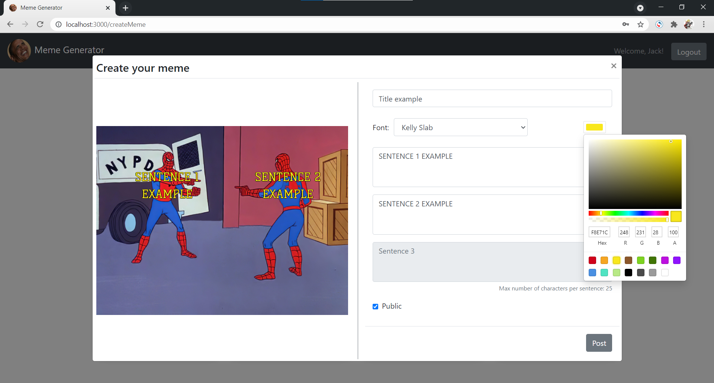

# Exam #2: "Meme Generator"
## Student: s283502 SANTANGELO ALESSIO 

## React Client Application Routes

- Route `/`: home page which contains all public memes (also the protected ones if user logged in)
- Route `/createMeme`: page which contains the list of meme templates and, after selecting one, it allows to create a personalized meme
- Route `/login`: log in page

## API Server

- GET `/api/memes` (get list of memes)
  - response body content: list of memes (all if authenticated, just public if not)

- POST `/api/memes` (insert a new meme)
  - request body content: meme's data

- DELETE `/api/memes/<id>` (delete meme id)
  - request parameters: meme's id to be deleted

- POST `/api/sessions` (log in)
  - request body content: username and password
  - response body content: username

- DELETE `/api/sessions/current` (log out)

- GET `/api/sessions` (check if logged in)
  - response body content: username

## Database Tables

- Table `creators` - contains: username, hash
- Table `memes` - contains: id, title, image, sentence1, sentence2, sentence3, public, creator, font, fontColor

## Main React Components

- `Main` (in `App.js`): it is the main component which contains all the other major components, states and useEffects
- `Navigation` (in `Navigation.js`): it is the component which displays the navigation bar
- `TemplatesList` (in `CreateMeme.js`): it displays the list of templates
- `LoginForm` (in `Login.js`): it provides the form and functionalities to perform the log in
- `MemeWrapper` (in `Memes.js`): it associates each meme with the right component which displays it correctly with the right sentences positions
- `MemesList` (in `MemesList.js`): it provides the list of memes to the home page
- `ModalHome` (in `Modals.js`): it displays the informations of the meme selected on the home page
- `ModalCreate` (in `Modals.js`): it provides the form and functionalities to create a meme from the selected template

## Screenshot

## Users Credentials

- Jack, imjackps
- Noyze, aRandomPassword
- xMarcoLux, 1234567
